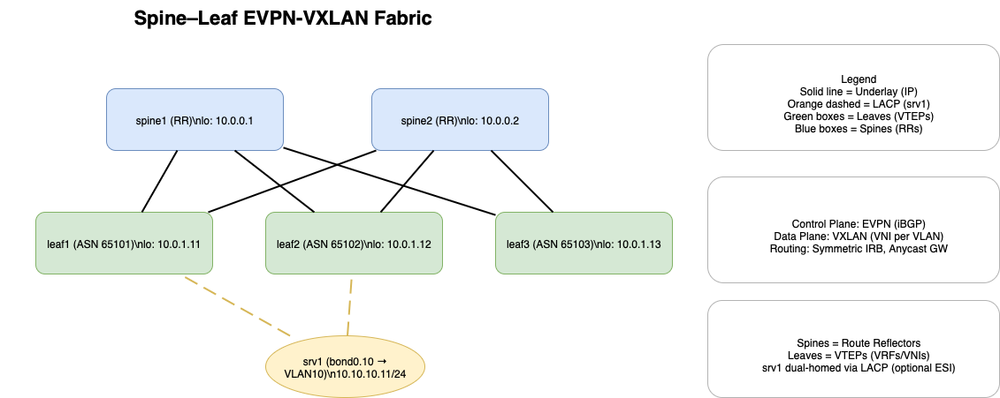

# Spine–Leaf EVPN-VXLAN Fabric (Containerlab + FRR)

A **fully reproducible, open-source data center fabric lab** that runs on a laptop.  
Implements a **modern spine–leaf architecture** with:

- **BGP EVPN** as the control plane  
- **VXLAN** as the overlay data plane  
- **Symmetric IRB** for inter-VLAN routing  
- **Anycast Gateway** for seamless host mobility  
- **ECMP** across spines for resiliency and load balancing  

Built with **containerlab + FRRouting (FRR)**, fully automated via **Ansible + Jinja2**, validated with **pytest + Batfish**, and monitored using **Prometheus + Grafana**.

---

## Architecture Diagram



---

## Key Features
- **Topology:** 2× Spines (RRs), 2× Leaves (VTEPs) – scalable to 3+ leaves  
- **Underlay:** Loopbacks + /31 P2P addressing  
- **Overlay:** BGP EVPN (Types 2, 3, 5) with VXLAN VNI per VLAN  
- **Routing:** Symmetric IRB per VRF, Anycast GW for each subnet  
- **Redundancy:** ECMP leaf↔spine paths, fast convergence  
- **v1.1 Enhancements:** EVPN ESI multihoming (dual-homed host), VRFs BLUE/GREEN, leaf3, richer telemetry

---

## Tech Stack
| Layer            | Technology |
|------------------|-----------|
| **Virtual Lab**  | [containerlab](https://containerlab.dev) |
| **Routing Stack**| [FRRouting (FRR)](https://frrouting.org) |
| **Automation**   | Ansible, Jinja2 |
| **Validation**   | pytest, Batfish |
| **Observability**| Prometheus, Grafana |
| **CI/CD**        | GitHub Actions (lint + config render) |

---

## Repository Layout
```bash
spine-leaf-evpn-vxlan/
├── topology/           # containerlab topology files
├── ansible/            # inventory, group_vars, host_vars, templates
├── configs/            # rendered configs (git-ignored except sample)
├── tests/              # pytest control plane/data plane tests
├── grafana/            # docker-compose, prometheus config, dashboards
└── scripts/            # helper scripts (post-deploy, collect outputs)
```

---

## Quickstart (MVP)

```bash
# 1. Install dependencies
pip install -r requirements.txt
pre-commit install

# 2. Deploy base topology + configs
make up
make deploy

# 3. Run automated tests
make test

# 4. Verify control plane
docker exec leaf1 vtysh -c "show bgp l2vpn evpn summary"
```

---

## Extended Lab (v1.1)

```bash
make up-esilab
make deploy
make post-esilab
make test
```

Adds:
- Leaf3 with additional VRFs
- Dual-homed srv1 host with LACP bonding
- EVPN ESI multihoming validation
- Grafana dashboards with BGP peer state + route counts

---

## Results & Screenshots

> **Note:** The outputs below are representative samples for documentation purposes.  
> When running the lab locally, regenerate them with:
> ```bash
> make up && make deploy && make test
> ./scripts/collect_outputs.sh
> ```

- [Leaf1 BGP EVPN Summary](outputs/mvp/leaf1_show_bgp_l2vpn_evpn_summary.txt)  
- [Leaf1 EVPN Routes](outputs/mvp/leaf1_show_bgp_evpn_routes.txt)  
- [Ping Results](outputs/mvp/ping_srv1_from_leaf1.txt)  
- [Pytest Results](outputs/tests/pytest_output.txt)

---

## Collecting Live Outputs
After running `make up && make deploy`, you can capture live results:
```bash
./scripts/collect_outputs.sh
```
This script stores:
 - ```bash show bgp l2vpn evpn summary```
 - ```bash show bgp evpn route```
 - VLAN ping tests
 - pytest results
and writes them into ```bash outputs/``` so they can be committed for reproducibility.

---

## Known Issues & Tips
- If FRR container fails on ESI configuration, comment out ESI section in `frr.conf.j2`.
- Make sure Docker is running and containerlab alias is set before running `make up`.
- Python 3.10+ required for ansible 9.x.

---

## Learning Outcomes / Talking Points
- Designed **scalable leaf–spine fabric** with EVPN control plane
- Automated **zero-touch configuration** via Ansible + Jinja templates
- Validated **control and data plane convergence** using pytest
- Instrumented network with **Prometheus exporters + Grafana dashboards**
- Practiced **CI/CD for network automation** (lint + config render in GitHub Actions)

---

## Future Enhancements
- Automate lab deployment in CI (GitHub Actions + containerlab runner)
- Add SRv6 or MPLS EVPN variant
- Integrate NetBox for intent-based config generation
- Expand Grafana dashboards for per-VNI traffic counters

---

## License
This project is licensed under the MIT License - see the [LICENSE](LICENSE) file for details.


